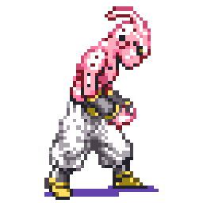

    

# About Me
 

### 🤗 Contributed Models to HF Transformers

- [**Ovis2**](https://huggingface.co/docs/transformers/main/en/model_doc/ovis2) from AIDC-AI

### 🏆 Awards

<strong>Click to View Award Records</strong>

 

| Rank | Task | Topic | Sponsor | Date |
|:------:|:-------:|:------:|:---------:|:------:|
| 🥈 | Object Detection       | 어종(魚種) 식별 및 분류 알고리즘 개발      | 한국수자원공사, AI Factory  | 2023.12 |
| 🥉 | Object Detection       | 위성영상을 활용한 정유탱크 탐지            | 한국항공우주연구원, AI Factory  | 2023.08 |
| 🥉 | Text Recognition (OCR) | 2023 교원그룹 AI 챌린지                   | 교원, 데이콘  | 2023.02 |
| 🥉 | Semantic Segmentation  | 폐암 병리 슬라이드 이미지 세그멘테이션  | 아주대학교 산학협력단, 한국지능정보사회진흥원 | 2022.12 |
| 🥈 | Super Resolution       | AI 양재 허브 인공지능 오픈소스 경진대회 |  AI 양재 허브, 데이콘 | 2022.11 |
| 🥈 | Object Detection       | Small Object AI Challenge 2021           | 과기정통부, 한국지능정보사회진흥원, 씨유박스 | 2021.12 |
| 🥉 | Object Detection       | 안전한 자율주행을 위한 인공지능 알고리즘 개발 챌린지 | 교통안전공단, 사람과숲  | 2021.12 |

